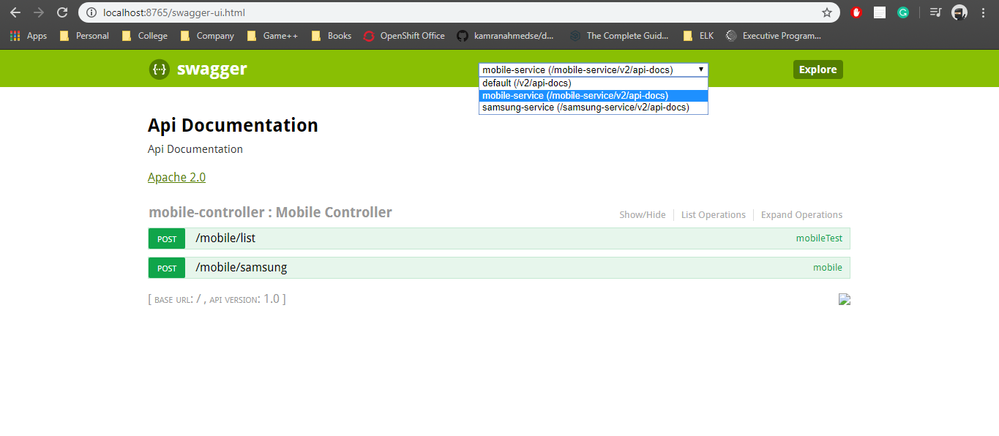

# Spring-Boot-Swagger

This project helps to create a single **Swagger** for multiple microservices.

Have created 4 microservics

1. [Eureka](https://github.com/aman7797/spring-boot-swagger/tree/master/eureka)
2. [Mobile Service](https://github.com/aman7797/spring-boot-swagger/tree/master/mobile)
3. [Samsung Service](https://github.com/aman7797/spring-boot-swagger/tree/master/samsung)
4. [Swagger Service](https://github.com/aman7797/spring-boot-swagger/tree/master/swagger)

## Dependencies to be added in *pom*

1. Swagger

    ```xml
        <dependency>
            <groupId>io.springfox</groupId>
            <artifactId>springfox-swagger2</artifactId>
            <version>2.6.1</version>
            <scope>compile</scope>
        </dependency>
                
        <dependency>
            <groupId>io.springfox</groupId>
            <artifactId>springfox-swagger-ui</artifactId>
            <version>2.6.1</version>
            <scope>compile</scope>
        </dependency>
    ```
2. Zuul
    
    Have used Zuul Proxy for scanning the registered microservices
    ```xml
    <dependency>
        <groupId>org.springframework.cloud</groupId>
        <artifactId>spring-cloud-starter-netflix-zuul</artifactId>
    </dependency>
    ```

## Output
    

